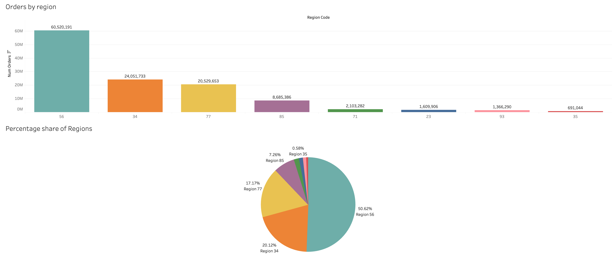
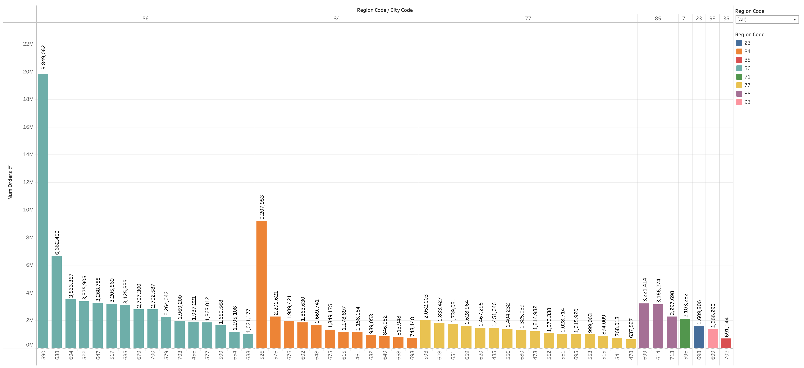
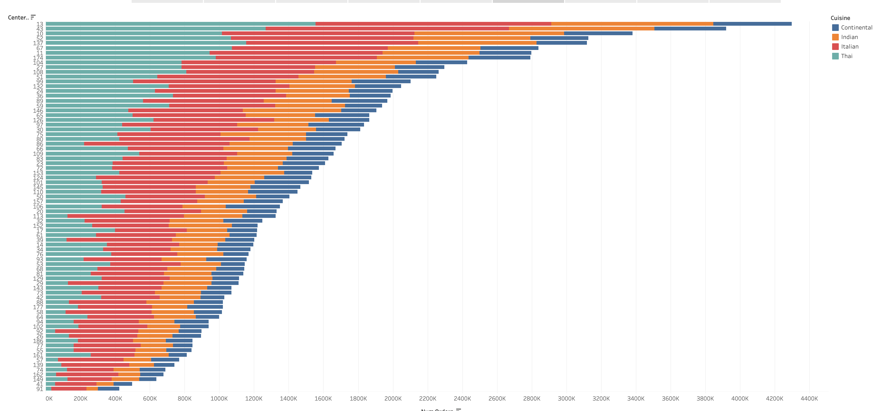
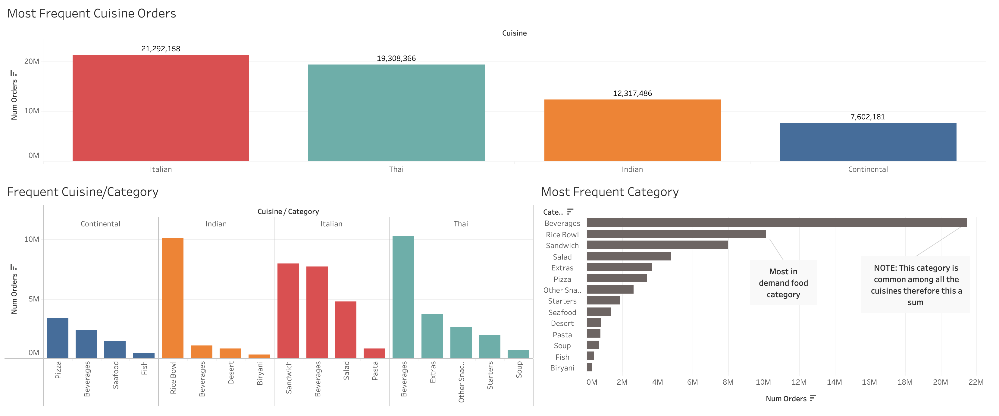
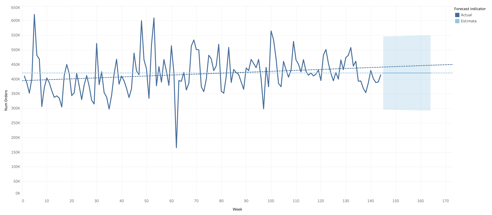

# Tableau-fulfilment-analysis
A Tableau-based analysis of fulfillment center operations, this project examines orders by region, city, and fulfillment center. It highlights top cuisines and food categories and provides a forecast. Interactive dashboards offer clear insights for strategic decision-making.

## Interactive Visualization
View the live Tableau dashboard [here](https://public.tableau.com/app/profile/humaid3646/viz/Project1_16584843735530/Fulfilmentcentreanalysis?publish=yes).

## Motivation
Food wastage is a critical issue impacting operational efficiency. This project tackles that problem by using interactive Tableau dashboards to analyze fulfillment centre data, helping improve sourcing strategies and reducing waste.

## Overview
The visualization project is presented as a series of pages, each focusing on a specific aspect of the data analysis—from regional order distribution to forecasting future demand. Each page is designed to guide the viewer through the insights step by step.

## Visualization Walkthrough

### Regional and City Analysis
- **Focus:** Identifying which regions and cities generate the most orders.
- **Design Choices:**  
  - **Bar and Pie Charts:** A bar chart ranks regions by order volume, while a pie chart presents the percentage share of each region.
  - **Text Annotations:** Storytelling elements explain the narrative, making the insights easily digestible.

### Fulfilment Centre Performance
- **Focus:** Analyzing performance across individual fulfillment centres.
- **Design Choices:**  
  - **Comparative Layout:** Charts highlight variations in order volumes across different centres.
  - **Clear Labels and Scales:** Numeric values and region codes are used for clarity.

   

### Cuisine and Food Category Trends
- **Focus:** Determining the most popular cuisines and food categories.
- **Design Choices:**  
  - **Segmented Visualization:** Separate charts for cuisines and food categories help pinpoint consumer preferences.
  - **Visual Hierarchy:** Emphasis on Italian cuisine and key categories like pizza, beverages, and seafood.

 

### Forecasting Orders
- **Focus:** Providing a forecast of weekly orders.
- **Design Choices:**  
  - **Line Charts:** Actual versus estimated order trends are shown to highlight potential future performance.
  - **Trend Indicators:** Forecast markers guide stakeholders in planning and resource allocation.

   

## Conclusion
By breaking down the analysis into focused, sequential pages, the project provides clear insights into operational efficiency, consumer preferences, and future demand. The interactive dashboards not only support strategic decision-making but also help address food wastage by optimizing material sourcing.

---
